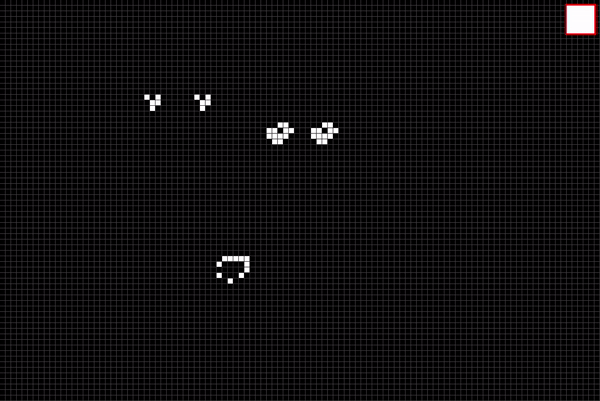

# Conways-game-of-life
Conway's game of life coded in C++ using SFML. Feel free to run if you have SFML set up.

-Instructions for customized simulation:

0) You must have SFML set up with your IDE.
1) Set the cell_size constant to any integer (this will be the size in pixels of a cell)
2) Set the UPDATE_RATE. The higher this value, the slower the animation will be.
3) Set WIDTH and HEIGHT as the desired resolution of the window in pixels.
4) Run the program
5) Draw in the canvas the initial configuration of the cells.
6) Press the white button whenever you want to start the animation.
7) Enjoy! (Close the program to finish simulation)

If none of this values are changed, the simulation will run as in the image below.

